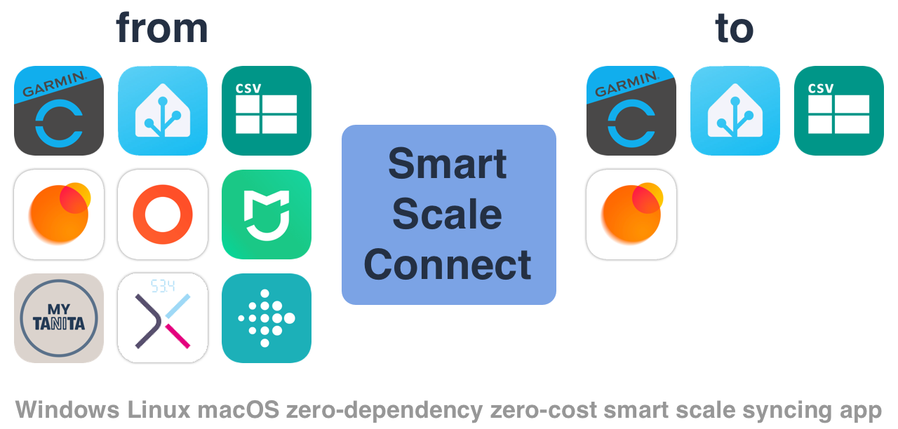

**SmartScaleConnect** - application for synchronizing smart scale data between different ecosystems.

**Features:**

- Load data from [Garmin], Zepp Life, Mi Fitness, [My TANITA], [CSV], [JSON]
- Save data to [Garmin], [Home Assistant], [CSV], [JSON]
- Support params: `Weight`, `BMI`, `Body Fat`, `Body Water`, `Bone Mass`, `Metabolic Age`, `Muscle Mass`, `Physique Rating`, `Visceral Fat`, `Basal Metabolism`, `Heart Rate`, `Skeletal Muscle Mass`
- Support multiple users data
- Support scripting language 

[Garmin]: https://connect.garmin.com/
[Home Assistant]: https://www.home-assistant.io/
[My TANITA]: https://mytanita.eu/
[CSV]: https://en.wikipedia.org/wiki/Comma-separated_values
[JSON]: https://en.wikipedia.org/wiki/JSON

**Inspired by:** series of projects from [@lswiderski](https://github.com/lswiderski).

**Attention.** The application is at an early stage of development. The configuration and functionality can change a lot.

## Fast start

- Download binary for your OS from [latest release](https://github.com/AlexxIT/SmartScaleConnect/releases/).
- Or use the Docker [container](https://hub.docker.com/r/alexxit/smartscaleconnect).
- Or add Home Assistant [add-on](https://my.home-assistant.io/redirect/supervisor_addon/?addon=a889bffc_scaleconnect&repository_url=https%3A%2F%2Fgithub.com%2FAlexxIT%2Fhassio-addons).

## Configuration

A configuration file with name `scaleconnect.yaml` may be located in the current working directory or near application binary.

The [YAML](https://en.wikipedia.org/wiki/YAML) format is very demanding on indentation and spaces. Please observe them.

After the first launch, the `scaleconnect.json` file may appear next to the configuration file. It contains the authorization credentials for your services.

Config file example:

```yaml
sync_alex_fitbit:
  from: fitbit AlexMyFitbitData.zip
  to: garmin alex@gmail.com garmin-password

sync_alex_zepp:
  from: zepp/xiaomi alex@gmail.com xiaomi-password
  to: garmin alex@gmail.com garmin-password
  expr:
    Weight: 'BodyFat == 0 || Date >= date("2024-11-25") ? 0 : Weight'

sync_alex_xiaomi:
  from: xiaomi alex@gmail.com xiaomi-password
  to: garmin alex@gmail.com garmin-password
  expr:
    Weight: 'BodyFat == 0 ? 0 : Weight'
    BodyFat: 'Date >= date("2025-04-01") && Source == "blt.3.1abcdefabcd00" ? 0 : BodyFat'
```

### Garmin


**Limitations:**

- Currently, two-factor authentication is not supported.
- Currently, China server is not supported.

You can use [Garmin] data as source:

```yaml
sync_garmin:
  from: garmin {username} {password}
  to: csv alex_garmin.csv
```

And as destination:

```yaml
sync_garmin:
  from: csv alex_garmin.csv
  to: garmin {username} {password}
```

If you want to upload custom manual data to Garmin, just import it from CSV file.

### Xiaomi Mi Fitness

Tested on scales:

- Mi Body Composition Scale S400 (MJTZC01YM) - getting other users data is supported.
- Xiaomi 8-Electrode Body Composition Scale (XMTZC01YM) - getting other users data is not supported yet.

Get data from all scales of the main user:

```yaml
sync_xiaomi:
  from: xiaomi {username} {password}
  to: csv alex_xiaomi.csv
```

Get the data of all users from specific scales:

```yaml
sync_xiaomi:
  from: xiaomi {username} {password} {scales model}
  to: csv all_users_xiaomi.csv
```

- You can check scales model name from Mi Fitness app > Device > Scale > About device > Device model.
- You can add a filter by username.

Example:

```yaml
sync_yulia_xiaomi:
  from: xiaomi alex@gmail.com xiaomi-password yunmai.scales.ms103
  to: csv yulia_xiaomi.csv
  expr:
    Weight: 'User == "Yulia" ? Weight : 0'
```

### Zepp Life

**Limitations:**

- Currently, only login via a Xiaomi account is supported.
- When syncing, you are logged out of the mobile app. It is not known how this problem can be fixed.

Tested on scales:

- Mi Body Composition Scale 2 (XMTZC05HM)

Get data from all scales of the main user:

```yaml
sync_zepp:
  from: zepp/xiaomi {username} {password}
  to: csv alex_zepp.csv
```

Getting data from all scales of the selected user:

```yaml
sync_zepp:
  from: zepp/xiaomi {username} {password} {username}
  to: csv alex_zepp.csv
```

### My TANINA

On Tanita servers, the weighing time is stored with an unknown time zone and may be incorrect.

```yaml
sync_tanita:
  from: tanita {username} {password}
  to: csv alex_tanita.csv
```

### Fitbit

My Fitbit Aria scales are no longer working. Therefore, I am interested in this service only from the point of view of archived data.

Google bought this service and sent an email with the subject "Take action by February 2, 2026 to keep using Fitbit". There they offer to [download all the data](https://www.fitbit.com/settings/data/export), otherwise it will disappear.

Supports retrieving data from the archive:

```yaml
sync_fitbit:
  from: fitbit MyFitbitData.zip
  to: csv alex_fitbit.csv
```

### CSV


A good format for human-readable text. The time inside the file is always your local time. Well-supported in MS Office. It is convenient to build quick analytics there.

You can use [CSV] file or HTTP-link as source and CSV file as destination:

```yaml
sync_csv:
  from: csv http://192.168.1.123/source.csv
  to: csv destination.csv
```

### JSON

Same as [CSV], but [JSON].

### Home Assistant

Each time app starts, the most recent weighing will be uploaded to the Home Assistant.

Modify the example as you like. Add the other parameters of your scales. The data will be saved during HA reboots. Graphs will remember the history of changes.

Add to your **configuration.yaml**:

```yaml
input_number:
  alex_weight:
    name: Alex Weight
    min: 50
    max: 80
    unit_of_measurement: kg
    icon: mdi:weight
  alex_bmi:
    name: Alex BMI
    min: 15
    max: 30
```

Add automation:

```yaml
alias: Weigth Data
triggers:
  - trigger: webhook
    allowed_methods: [ POST ]
    local_only: true
    webhook_id: "594b7e73-1f0f-4c3c-aded-eeaee78a6790"
conditions: []
actions:
  - action: persistent_notification.create
    data:
      message: "{{ trigger.json }}"  # only for tests
  - action: input_number.set_value
    data:
      value: "{{ trigger.json.Weight|round(2) }}"
    target:
      entity_id: input_number.alex_weight  # change here
  - action: input_number.set_value
    data:
      value: "{{ trigger.json.BMI|round(2) }}"
    target:
      entity_id: input_number.alex_bmi  # change here
mode: single
```

Add to `scaleconnect.yaml`:

```yaml
sync_hass:
  from: xiaomi alex@gmail.com xiaomi-password
  to: json/latest http://192.168.1.123:8123/api/webhook/594b7e73-1f0f-4c3c-aded-eeaee78a6790
```

## Sync logic

Every time you start the app, the weight data is fully synchronized:

- All the source data for the entire time is loaded.
- All destination data for the entire time is loaded.
- If the timestamp completely matches, the data is considered the same.
  - If all other parameters match, the weighting **is skipped**.
  - If the other parameters are different, the weighting is **completely replaced** by the new data.
  - If the `Weight` column is zero, the destination weighting **is deleted**.
- If the timestamp does not match, the weighing **is uploaded** to the service.
- If the `Weight` column has zero, the weighting **is skipped**.

At the first start, I recommend downloading all your data from all services to CSV file and analyze it in Excel for some incorrect data.

If you need to delete a lot of incorrect data from Garmin, you can download it to CSV file, put zeros in the `Weight` column, and then upload this CSV file to Garmin again.

## Scripting language

You can change the synchronization behavior and change the weighting values using the powerful scripting language - [expr](https://expr-lang.org/).

```yaml
sync_expr:
  expr:
    Date: 'Date - duration("1h")'  # you can adjust the weighing time
    Weight: 'Weight > 60 ? 0 : Weight'  # you can use conditions
    BMI: 'BMI * 0.95'  # mathematical formulas can be used
    BodyFat: 'BodyFat - 5.0'  # mathematical formulas can be used
    BodyWater: 'BodyWater'
    BoneMass: 'BoneMass'
    MuscleMass: 'MuscleMass'
    SkeletalMuscleMass: 'SkeletalMuscleMass'
    MetabolicAge: 'MetabolicAge'
    PhysiqueRating: 'PhysiqueRating'
    VisceralFat: 'VisceralFat'
    BasalMetabolism: 'BasalMetabolism'
    HeartRate: 'HeartRate'
    User: 'User'
    Source: 'Source + " some other text"'  # adding custom text information
```

For example, many scales measure the `MuscleMass` parameter. Although professional scales, including Garmin, measure `SkeletalMuscleMass`. If you want the `MuscleMass` parameter to be displayed in Garmin instead of `SkeletalMuscleMass`, do this:

```yaml
sync_expr:
  expr:
    SkeletalMuscleMass: 'MuscleMass'  # replace the skeletal mass data with a regular mass
```

For example, I bought a new scale from Xiaomi and don't want to sync data from the Zepp after a certain date. And also I don't want to synchronize data without fat information (incorrect weighings):

```yaml
sync_alex_zepp:
  expr:
    Weight: 'BodyFat == 0 || Date >= date("2024-11-25") ? 0 : Weight'
```

Or I bought a new **Xiaomi 8-Electrode Scale** in addition to the old one **Xiaomi S400**. Now the S400 shows a completely wrong fat percentage. But I want to leave the weights from ols scales because they have **skeletal muscle mass** data, and the new scales don't have this param. Also, I want to ignore weighing without fat information.

```yaml
sync_alex_xiaomi:
  expr:
    Weight: 'BodyFat == 0 ? 0 : Weight'  # ignore weighing without fat information
    BodyFat: 'Date >= date("2025-04-01") && Source == "blt.3.1abcdefabcd00" ? 0 : BodyFat'  # zero body fat from old scales
```

## Known Scales

| Scale                                                 | Price | Application    | Sync         | Comment                 |
|-------------------------------------------------------|-------|----------------|--------------|-------------------------|
| Garmin Index S2 Smart Scale (010-02294-02)            | $200  | Garmin Connect | Wi-Fi        | Simple impedance        |
| Fitbit Aria Air Smart Scale (FB203WT)                 | $50   | Fitbit         | Wi-Fi        | Simple impedance        |
| Mi Smart Scale 2                                      | $20   | Zepp Life      | Mobile Phone | No impedance            |
| Mi Body Composition Scale 2 (XMTZC05HM)               | $30   | Zepp Life      | Mobile Phone | Simple impedance        |
| Mi Body Composition Scale S400 (MJTZC01YM)            | $30   | Xiaomi Home    | BLE Gateway  | Dual-frequncy impedance |
| Xiaomi 8-Electrode Body Composition Scale (XMTZC01YM) | $65   | Mi Fitness     | Wi-Fi        | 8-Electrode impedance   |

## Useful links

- https://github.com/lswiderski/WebBodyComposition
